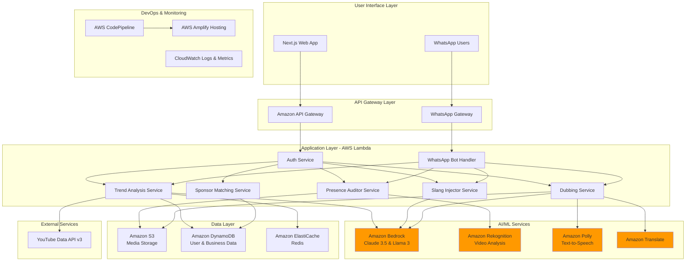
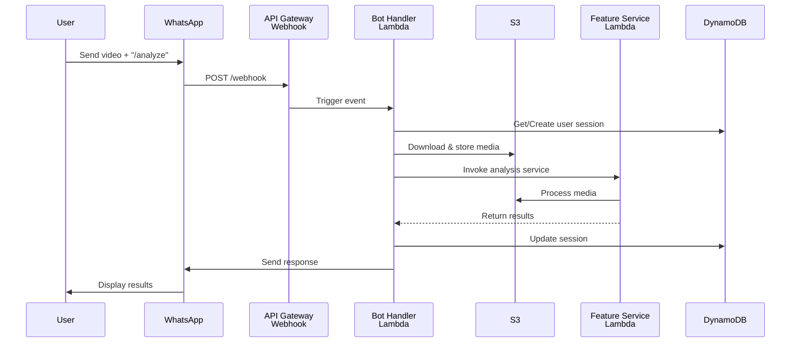
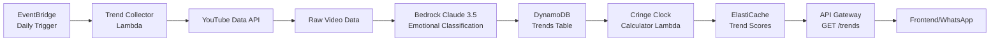
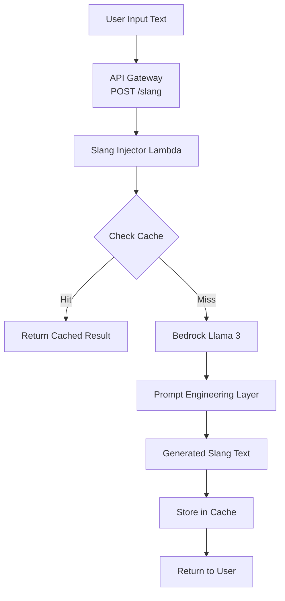
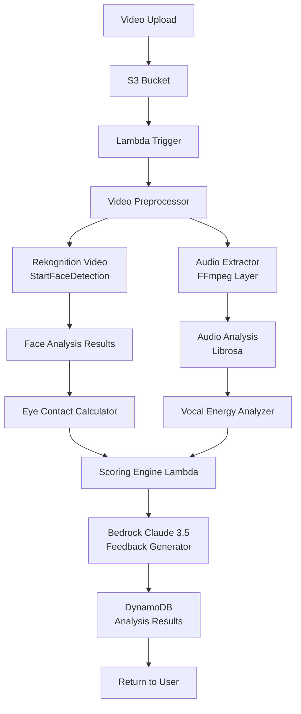
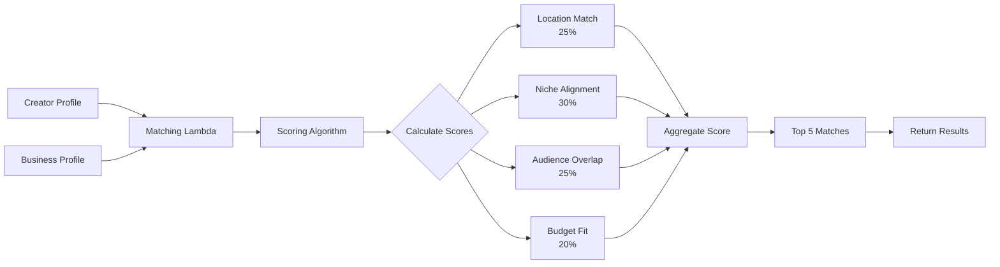
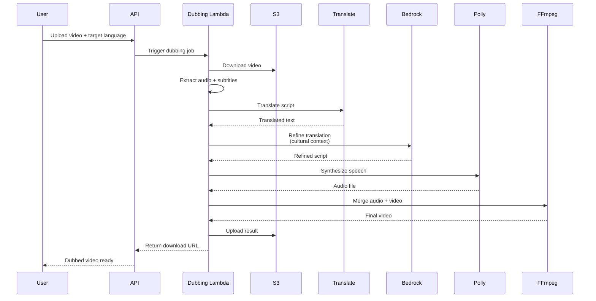
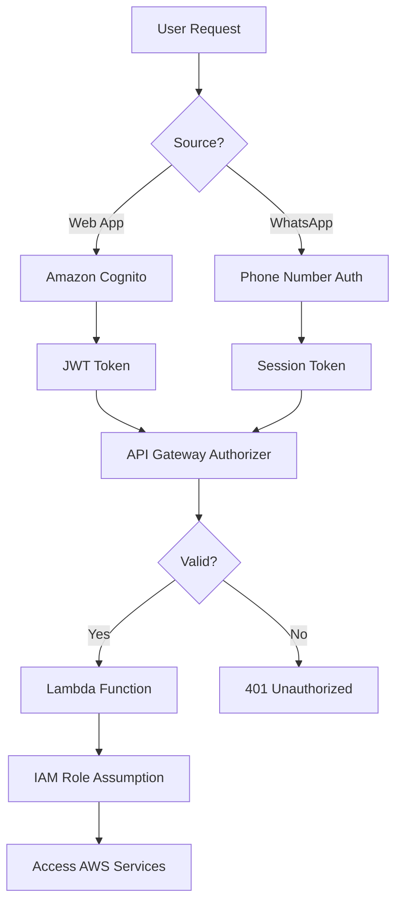
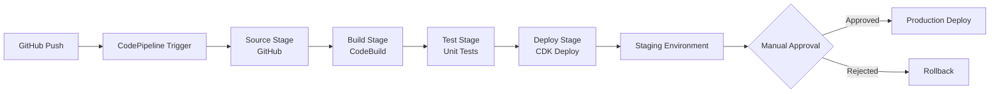

# VibeEngine AI - System Design Document

## 1. System Architecture Overview

VibeEngine AI is built on AWS cloud infrastructure using a serverless, event-driven architecture. The system prioritizes scalability, cost-efficiency, and ease of maintenance through managed services.

### 1.1 Architecture Principles

- **Serverless-First**: Minimize operational overhead using Lambda, API Gateway, and managed services
- **Event-Driven**: Asynchronous processing for media analysis and AI operations
- **Microservices**: Loosely coupled services for each core feature
- **API-First**: RESTful APIs for all service interactions
- **Security by Design**: IAM roles, encryption, and least-privilege access

### 1.2 High-Level Architecture



## 2. Component Design

### 2.1 Frontend - Next.js Web Application

**Technology Stack**:
- Framework: Next.js 14 (App Router)
- UI Library: React 18
- Styling: Tailwind CSS
- State Management: React Context + SWR for data fetching
- Hosting: AWS Amplify

**Key Pages**:
- `/dashboard` - Creator dashboard with trend insights
- `/analyze` - Upload and analyze videos
- `/trends` - Trend Pattern Analysis visualization
- `/slang` - Slang Injector tool
- `/sponsors` - Gully Sponsor Engine marketplace
- `/profile` - User profile and settings

**Deployment**:
- Hosted on AWS Amplify with automatic CI/CD
- Environment variables managed through Amplify Console
- CloudFront CDN for global content delivery

### 2.2 WhatsApp Bot Interface

**Architecture**:



**Implementation Details**:
- **Webhook Endpoint**: API Gateway REST API with Lambda integration
- **Message Processing**: Lambda function (Node.js 20.x runtime)
- **Session Management**: DynamoDB with TTL (24-hour sessions)
- **Media Handling**: Direct upload to S3 with presigned URLs
- **Command Parser**: Natural language understanding using Bedrock

**Supported Commands**:
- `/analyze [video/audio]` - Presence analysis
- `/trends [topic]` - Get trend insights
- `/slang [text]` - Convert to regional slang
- `/dub [video] [language]` - Generate voiceover
- `/sponsors` - Find local sponsors
- `/help` - Command reference

### 2.3 Trend Pattern Analysis Service

**Data Flow**:



**Components**:

1. **Trend Collector Lambda**
   - Runtime: Python 3.12
   - Trigger: EventBridge (daily at 2 AM IST)
   - Function: Fetch trending videos from YouTube Data API
   - Output: Store raw data in S3 + metadata in DynamoDB

2. **Emotional Classifier**
   - Model: Amazon Bedrock - Claude 3.5 Sonnet
   - Input: Video title, description, tags, top comments
   - Output: Emotional category + confidence score
   - Batch Processing: 100 videos per invocation

3. **Cringe Clock Calculator**
   - Algorithm: Time-series analysis of trend frequency
   - Metrics: Upload velocity, engagement decay, creator diversity
   - Storage: ElastiCache Redis for real-time access
   - Update Frequency: Every 6 hours

**DynamoDB Schema - Trends Table**:
```json
{
  "PK": "TREND#<topic_id>",
  "SK": "DATE#<YYYY-MM-DD>",
  "topic": "string",
  "emotion": "string",
  "confidence": "number",
  "video_count": "number",
  "total_views": "number",
  "avg_engagement": "number",
  "saturation_score": "number",
  "region": "string",
  "created_at": "timestamp"
}
```

### 2.4 Slang Injector Service

**Architecture**:



**Prompt Engineering**:
```
System: You are a regional language expert specializing in Indian slang.
Convert the following English text to {slang_type} while maintaining meaning.
Intensity: {intensity}%
Preserve: {protected_words}

Input: {user_text}
Output: Transformed text with natural slang integration.
```

**Slang Types & Examples**:
- **Bambaiyya**: "What's up?" → "Kya scene hai bawa?"
- **Hinglish**: "I'm very busy" → "Main bahut busy hoon yaar"
- **Tanglish**: "Let's go eat" → "Chalaam saapda poga"

**Lambda Configuration**:
- Runtime: Python 3.12
- Memory: 512 MB
- Timeout: 30 seconds
- Concurrency: 100 reserved

### 2.5 Presence Auditor Service

**Processing Pipeline**:



**Rekognition Video Analysis**:
- **Face Detection**: Track face position and orientation
- **Gaze Estimation**: Calculate eye contact percentage
- **Expression Analysis**: Detect emotions (happy, neutral, sad)
- **Frame Rate**: Process at 1 FPS for efficiency

**Audio Analysis (Custom Lambda Layer)**:
- **Libraries**: FFmpeg, Librosa, NumPy
- **Metrics**:
  - RMS Energy (vocal power)
  - Zero Crossing Rate (speech clarity)
  - Spectral Centroid (voice brightness)
  - Pause detection (silence > 2 seconds)

**Scoring Algorithm**:
```python
presence_score = (
    eye_contact_percentage * 0.30 +
    vocal_energy_score * 0.30 +
    expression_consistency * 0.20 +
    posture_stability * 0.20
)
```

**DynamoDB Schema - Analysis Table**:
```json
{
  "PK": "USER#<user_id>",
  "SK": "ANALYSIS#<timestamp>",
  "video_url": "string",
  "presence_score": "number",
  "eye_contact": "number",
  "vocal_energy": "number",
  "expression_score": "number",
  "posture_score": "number",
  "feedback": "string",
  "improvement_tips": ["array"],
  "processed_at": "timestamp"
}
```

### 2.6 Gully Sponsor Engine

**Matching Algorithm**:



**DynamoDB Schema - Creators Table**:
```json
{
  "PK": "CREATOR#<user_id>",
  "SK": "PROFILE",
  "name": "string",
  "location": {"city": "string", "state": "string"},
  "niche": ["array"],
  "audience_demographics": {
    "age_range": "string",
    "gender_split": "object",
    "top_cities": ["array"]
  },
  "engagement_rate": "number",
  "avg_views": "number",
  "pricing": {"min": "number", "max": "number"},
  "portfolio_urls": ["array"]
}
```

**DynamoDB Schema - Businesses Table**:
```json
{
  "PK": "BUSINESS#<business_id>",
  "SK": "PROFILE",
  "name": "string",
  "industry": "string",
  "location": {"city": "string", "state": "string"},
  "target_audience": "string",
  "budget_range": {"min": "number", "max": "number"},
  "campaign_goals": ["array"],
  "preferred_niches": ["array"]
}
```

### 2.7 Universal Voiceover Service

**Dubbing Workflow**:



**Amazon Polly Configuration**:
- **Engine**: Neural TTS for natural voices
- **Voices**: 
  - Hindi: Kajal (Female), Aditi (Female)
  - Tamil: Anjali (Female)
  - Telugu: Sameera (Female)
- **SSML Support**: For pronunciation control and pauses

**Translation Enhancement**:
- Use Bedrock to add cultural context and idioms
- Maintain lip-sync timing constraints
- Preserve brand names and technical terms

### 2.8 Authentication & Authorization

**User Authentication Flow**:



**Amazon Cognito Configuration**:
- User Pool for web application users
- Email/Phone verification
- MFA optional for business accounts
- Custom attributes: user_type (creator/business), location, niche

**WhatsApp Authentication**:
- Phone number as unique identifier
- OTP verification on first use
- Session tokens stored in DynamoDB with 24-hour TTL

## 3. Data Models

### 3.1 DynamoDB Table Design

**Single Table Design Pattern**:

| PK | SK | Attributes |
|----|----|------------|
| USER#123 | PROFILE | name, email, phone, location, niche, created_at |
| USER#123 | ANALYSIS#2024-01-15 | video_url, scores, feedback, timestamp |
| TREND#viral-dance | DATE#2024-01-15 | emotion, saturation, video_count, views |
| BUSINESS#456 | PROFILE | name, industry, budget, location |
| CREATOR#123 | PORTFOLIO#1 | video_url, views, engagement, uploaded_at |

**Global Secondary Indexes (GSI)**:
1. **GSI-Location**: PK=location, SK=user_type (for sponsor matching)
2. **GSI-Niche**: PK=niche, SK=engagement_rate (for creator discovery)
3. **GSI-Trends**: PK=emotion, SK=saturation_score (for trend queries)

### 3.2 S3 Bucket Structure

```
vibeengine-media/
├── uploads/
│   ├── {user_id}/
│   │   ├── videos/
│   │   │   └── {timestamp}_{filename}.mp4
│   │   └── audio/
│   │       └── {timestamp}_{filename}.mp3
├── processed/
│   ├── dubbed/
│   │   └── {job_id}_{language}.mp4
│   └── thumbnails/
│       └── {video_id}.jpg
└── reports/
    └── trends/
        └── {date}_trend_report.pdf
```

**Lifecycle Policies**:
- Uploads: Move to S3 Glacier after 90 days
- Processed: Move to Intelligent-Tiering after 30 days
- Reports: Delete after 365 days

## 4. API Specifications

### 4.1 REST API Endpoints

**Base URL**: `https://api.vibeengine.ai/v1`

#### Trend Analysis APIs

```
GET /trends
Query Parameters:
  - region: string (optional)
  - emotion: string (optional)
  - limit: number (default: 10)
Response: {
  "trends": [
    {
      "topic": "string",
      "emotion": "string",
      "saturation_score": number,
      "video_count": number,
      "growth_rate": number
    }
  ]
}

GET /trends/{topic}/cringe-clock
Response: {
  "topic": "string",
  "saturation_score": number,
  "predicted_peak": "date",
  "days_remaining": number,
  "recommendation": "string"
}
```

#### Slang Injector APIs

```
POST /slang/convert
Body: {
  "text": "string",
  "slang_type": "bambaiyya|hinglish|tanglish",
  "intensity": number (0-100),
  "preserve_words": ["array"]
}
Response: {
  "original": "string",
  "converted": "string",
  "slang_type": "string"
}
```

#### Presence Auditor APIs

```
POST /analyze/presence
Body: {
  "video_url": "string"
}
Response: {
  "job_id": "string",
  "status": "processing"
}

GET /analyze/presence/{job_id}
Response: {
  "status": "completed|processing|failed",
  "presence_score": number,
  "breakdown": {
    "eye_contact": number,
    "vocal_energy": number,
    "expression": number,
    "posture": number
  },
  "feedback": "string",
  "improvement_tips": ["array"],
  "timestamp_insights": [
    {"time": "00:15", "issue": "string", "suggestion": "string"}
  ]
}
```

#### Sponsor Matching APIs

```
GET /sponsors/matches
Query Parameters:
  - user_id: string
  - limit: number (default: 5)
Response: {
  "matches": [
    {
      "business_id": "string",
      "name": "string",
      "industry": "string",
      "match_score": number,
      "location": "string",
      "budget_range": {"min": number, "max": number}
    }
  ]
}

POST /sponsors/connect
Body: {
  "creator_id": "string",
  "business_id": "string",
  "message": "string"
}
Response: {
  "connection_id": "string",
  "status": "pending"
}
```

#### Dubbing APIs

```
POST /dub/create
Body: {
  "video_url": "string",
  "target_language": "string",
  "voice_preference": "male|female"
}
Response: {
  "job_id": "string",
  "estimated_time": number
}

GET /dub/{job_id}
Response: {
  "status": "completed|processing|failed",
  "dubbed_video_url": "string",
  "language": "string"
}
```

### 4.2 WhatsApp Webhook API

```
POST /webhook/whatsapp
Headers:
  - X-WhatsApp-Signature: string
Body: {
  "from": "string",
  "message": {
    "type": "text|image|video|audio",
    "content": "string|url"
  }
}
Response: {
  "status": "received"
}
```

## 5. Infrastructure as Code

### 5.1 AWS CDK Stack Structure

```
vibeengine-cdk/
├── lib/
│   ├── api-stack.ts          # API Gateway + Lambda functions
│   ├── storage-stack.ts      # S3 + DynamoDB
│   ├── ai-stack.ts           # Bedrock, Rekognition, Polly
│   ├── frontend-stack.ts     # Amplify hosting
│   └── monitoring-stack.ts   # CloudWatch dashboards
├── bin/
│   └── vibeengine.ts         # CDK app entry point
└── package.json
```

### 5.2 Lambda Function Organization

```
lambda/
├── trend-analysis/
│   ├── collector/
│   │   └── index.py
│   ├── classifier/
│   │   └── index.py
│   └── cringe-clock/
│       └── index.py
├── slang-injector/
│   └── index.py
├── presence-auditor/
│   ├── video-processor/
│   │   └── index.py
│   └── audio-analyzer/
│       └── index.py
├── sponsor-matching/
│   └── index.py
├── dubbing/
│   └── index.py
└── whatsapp-bot/
    └── index.js
```

## 6. Security Architecture

### 6.1 IAM Roles & Policies

**Lambda Execution Roles**:

```json
{
  "Version": "2012-10-17",
  "Statement": [
    {
      "Effect": "Allow",
      "Action": [
        "s3:GetObject",
        "s3:PutObject"
      ],
      "Resource": "arn:aws:s3:::vibeengine-media/*"
    },
    {
      "Effect": "Allow",
      "Action": [
        "dynamodb:GetItem",
        "dynamodb:PutItem",
        "dynamodb:Query"
      ],
      "Resource": "arn:aws:dynamodb:*:*:table/VibeEngine*"
    },
    {
      "Effect": "Allow",
      "Action": [
        "bedrock:InvokeModel"
      ],
      "Resource": "*"
    }
  ]
}
```

### 6.2 Data Encryption

- **At Rest**: 
  - S3: SSE-S3 encryption
  - DynamoDB: AWS-managed encryption keys
- **In Transit**: 
  - TLS 1.2+ for all API communications
  - Signed URLs for S3 media access

### 6.3 API Security

- API Gateway with API keys for web app
- Rate limiting: 100 requests/minute per user
- WAF rules to prevent SQL injection and XSS
- CORS configuration for frontend domain only

## 7. Monitoring & Observability

### 7.1 CloudWatch Dashboards

**Key Metrics**:
- Lambda invocation count and duration
- API Gateway 4xx/5xx error rates
- DynamoDB read/write capacity utilization
- S3 storage usage and request count
- Bedrock API call count and latency

### 7.2 Alarms

```
- Lambda Error Rate > 5% (5 minutes)
- API Gateway Latency > 2 seconds (p99)
- DynamoDB Throttled Requests > 10
- S3 4xx Errors > 100 (5 minutes)
```

### 7.3 Logging Strategy

- Structured JSON logs with correlation IDs
- Log retention: 30 days for application logs
- CloudWatch Insights queries for debugging
- X-Ray tracing for distributed request tracking

## 8. CI/CD Pipeline

### 8.1 AWS CodePipeline Stages



### 8.2 CodeBuild Configuration

```yaml
version: 0.2
phases:
  install:
    runtime-versions:
      nodejs: 20
      python: 3.12
  pre_build:
    commands:
      - npm install
      - pip install -r requirements.txt
  build:
    commands:
      - npm run test
      - npm run build
      - cdk synth
  post_build:
    commands:
      - cdk deploy --require-approval never
```

## 9. Cost Estimation

### 9.1 Monthly Cost Breakdown (1000 Active Users)

| Service | Usage | Cost |
|---------|-------|------|
| Lambda | 5M invocations, 512MB avg | $25 |
| API Gateway | 10M requests | $35 |
| DynamoDB | 10GB storage, on-demand | $15 |
| S3 | 500GB storage, 1M requests | $12 |
| Bedrock (Claude 3.5) | 1M input tokens, 500K output | $120 |
| Bedrock (Llama 3) | 2M input tokens, 1M output | $40 |
| Rekognition Video | 100 hours analysis | $150 |
| Polly | 5M characters | $20 |
| Amplify Hosting | 100GB bandwidth | $15 |
| CloudWatch | Logs + Metrics | $10 |
| **Total** | | **$442/month** |

### 9.2 Cost Optimization Strategies

- Use Lambda reserved concurrency for predictable workloads
- Implement caching with ElastiCache to reduce Bedrock calls
- S3 Intelligent-Tiering for automatic cost optimization
- DynamoDB on-demand pricing for variable traffic
- Batch processing for non-urgent AI operations

## 10. Deployment Strategy

### 10.1 Environment Setup

**Environments**:
1. **Development**: Personal developer environments
2. **Staging**: Pre-production testing with production-like data
3. **Production**: Live user-facing environment

### 10.2 Deployment Process

1. Developer pushes code to GitHub feature branch
2. Automated tests run on CodeBuild
3. Merge to `main` triggers staging deployment
4. Manual testing on staging environment
5. Manual approval gate for production deployment
6. Blue-green deployment to production
7. Automated rollback on CloudWatch alarm triggers

### 10.3 Database Migration Strategy

- Use DynamoDB streams for data replication
- Maintain backward compatibility for 2 versions
- Feature flags for gradual rollout
- Automated backup before schema changes

## 11. Disaster Recovery

### 11.1 Backup Strategy

- **DynamoDB**: Point-in-time recovery (35 days)
- **S3**: Versioning enabled with lifecycle policies
- **Lambda**: Code stored in GitHub + S3
- **Configuration**: Infrastructure as Code in GitHub

### 11.2 Recovery Objectives

- **RTO (Recovery Time Objective)**: 4 hours
- **RPO (Recovery Point Objective)**: 1 hour
- **Multi-Region**: Future consideration for global expansion

## 12. Performance Optimization

### 12.1 Caching Strategy

**ElastiCache Redis**:
- Trend data: 6-hour TTL
- Slang conversions: 24-hour TTL
- User profiles: 1-hour TTL
- Sponsor matches: 12-hour TTL

### 12.2 Lambda Optimization

- Use Lambda layers for shared dependencies (FFmpeg, ML libraries)
- Provisioned concurrency for latency-sensitive functions
- Optimize cold start with smaller deployment packages
- Use Lambda SnapStart for Java functions (if applicable)

### 12.3 Database Optimization

- DynamoDB single-table design to minimize queries
- GSI for efficient access patterns
- Batch operations for bulk reads/writes
- DynamoDB Accelerator (DAX) for read-heavy workloads (future)

## 13. Scalability Considerations

### 13.1 Auto-Scaling Configuration

- **Lambda**: Automatic scaling up to 1000 concurrent executions
- **DynamoDB**: On-demand capacity mode with auto-scaling
- **API Gateway**: No scaling configuration needed (fully managed)
- **S3**: Unlimited scalability

### 13.2 Load Testing

- Use AWS Distributed Load Testing solution
- Target: 1000 concurrent users
- Test scenarios:
  - Video upload and analysis
  - Trend API queries
  - WhatsApp bot interactions
  - Sponsor matching queries

## 14. Future Enhancements

### 14.1 Phase 2 Features

- Real-time collaboration tools for creators
- Advanced analytics dashboard with predictive insights
- Mobile native apps (iOS/Android)
- Live streaming analysis
- Automated video editing with AI

### 14.2 Technical Improvements

- GraphQL API for flexible data queries
- WebSocket support for real-time updates
- Multi-region deployment for global reach
- Machine learning model training pipeline
- A/B testing framework for feature rollout

---

## Appendix A: Technology Stack Summary

| Layer | Technology |
|-------|-----------|
| Frontend | Next.js 14, React 18, Tailwind CSS |
| API Gateway | Amazon API Gateway (REST) |
| Compute | AWS Lambda (Node.js 20.x, Python 3.12) |
| AI/ML | Amazon Bedrock, Rekognition, Polly, Translate |
| Database | Amazon DynamoDB |
| Storage | Amazon S3 |
| Cache | Amazon ElastiCache (Redis) |
| Auth | Amazon Cognito |
| Hosting | AWS Amplify |
| CI/CD | AWS CodePipeline, CodeBuild |
| Monitoring | Amazon CloudWatch, X-Ray |
| IaC | AWS CDK (TypeScript) |

## Appendix B: External API Dependencies

| API | Purpose | Rate Limits |
|-----|---------|-------------|
| YouTube Data API v3 | Trend data collection | 10,000 units/day |
| WhatsApp Business API | Bot messaging | 1,000 messages/day (tier 1) |

## Appendix C: Compliance & Privacy

- **Data Residency**: All data stored in AWS Mumbai region (ap-south-1)
- **GDPR Compliance**: User data deletion on request within 30 days
- **Data Retention**: User data retained for 2 years, then archived
- **Privacy Policy**: Transparent data usage disclosure
- **Terms of Service**: Clear usage guidelines and limitations

---

**Document Version**: 1.0  
**Last Updated**: February 15, 2026  
**Authors**: VibeEngine AI Team  
**Status**: Draft for AWS AI for Bharat Hackathon
